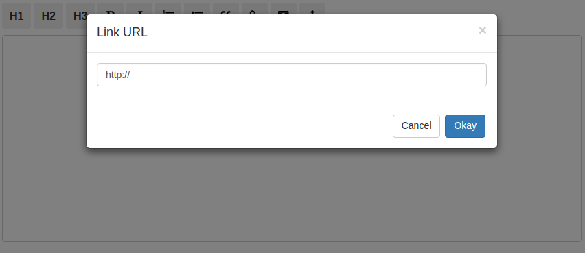

Custom Prompt
=============
Some commands will prompt the client to enter a value, such as when adding a link or image. By default the editor uses the standard browser prompt, but that can be changed by passing a function to the `onPrompt` prop. The function must return a promise which resolves to the value entered by the client.

The following example uses the [Bootstrap modal](http://getbootstrap.com/javascript/#modals) to prompt the client for an image or link URL. You must first add [jQuery](http://code.jquery.com/) and the [Bootstrap CSS and Javascript](https://www.bootstrapcdn.com/) to your project. (Not covered by this document.)

Start by creating a Modal component. The component has a `show()` method which receives a function to call after the client enters a value. The method will open the modal.

```jsx
import React from 'react';

class Modal extends React.Component {
  constructor(props) {
    super(props);
    this.state = {
      title:   '',
      resolve: null
    };
  }

  componentDidMount() {
    this.modal = $('#story-modal');
    this.input = $('#story-modal-input');
    this.modal.on('shown.bs.modal', () => {
      this.input.focus();
    });
  }

  /**
   * Opens the modal
   *
   * @param {String}   title   The modal title
   * @param {Function} resolve Called when the client enters a value
   */
  show = (title, resolve) => {
    this.setState({ title, resolve }, () => {
      this.input.val('http://');
      this.modal.modal('show');
    });
  };

  /**
   * Called when the client clicks the 'Okay' button
   */
  handleOkay = () => {
    if (this.state.resolve) {
      this.state.resolve(this.input.val());
      this.modal.modal('hide');
    }
  };

  /**
   * Triggers the handleOkay() callback when the client presses their
   * ENTER key
   */
  handleKeyDown = (e) => {
    if (e.keyCode === 13) {
      e.preventDefault();
      this.handleOkay();
    }
  };

  render() {
    const { title } = this.state;

    // See http://getbootstrap.com/javascript/#modals for more information
    // on the Bootstrap modal.
    return (
      <div id="story-modal" className="modal fade" role="dialog">
        <div className="modal-dialog" role="document">
          <div className="modal-content">
            <div className="modal-header">
              <button className="close" data-dismiss="modal">
                <span aria-hidden="true">&times;</span>
              </button>
              <h4 className="modal-title">
                {title}
              </h4>
            </div>
            <div className="modal-body">
              <p>
                <input
                  type="text"
                  id="story-modal-input"
                  className="form-control"
                  onKeyDown={this.handleKeyDown}
                />
              </p>
            </div>
            <div className="modal-footer">
              <button
                type="button"
                className="btn btn-default"
                data-dismiss="modal"
              >
                  Cancel
              </button>
              <button
                type="button"
                className="btn btn-primary"
                onClick={this.handleOkay}
              >
                Okay
              </button>
            </div>
          </div>
        </div>
      </div>
    );
  }
}
```

Now create your app and mount it.

```jsx
import React from 'react';
import ReactDOM from 'react-dom';
import Markmirror from 'react-markmirror';
import Modal from './modal.jsx';

class App extends React.Component {
  constructor(props) {
    super(props);
    this.state = {
      code: ''
    };
  }

  handleChange = (code) => {
    this.setState({ code });
  };

  /**
   * Passed to the onPrompt prop
   *
   * Passes the promise resolve function to the modal. The modal will
   * call the function once the client enters a URL.
   *
   * @param {String} type Will be one of 'image' or 'link'
   * @param {String} title Prompt title from i18n prop
   */
  handlePrompt = (type, title) => (
    new Promise((resolve) => {
      this.modalRef.show(title, resolve);
    })
  );

  render() {
    const { code } = this.state;

    // Pass our prompt handling function to the onPrompt prop to use
    // the custom modal.
    return (
      <section>
        <Modal ref={(ref) => { this.modalRef = ref; }} />
        <Markmirror
          value={code}
          onPrompt={this.handlePrompt}
          onChange={this.handleChange}
        />
      </section>
    );
  }
}

ReactDOM.render(<App />, document.getElementById('mount'));
```

Now when the client clicks the link or image button, they will be prompted for the URL using the custom modal.


