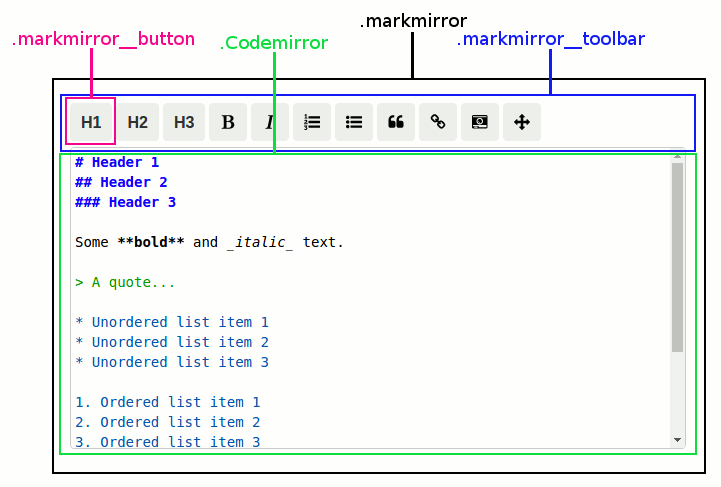

Styling
=======
The editor can be styled with the use of CSS classes. Either by overriding the built in classes, or adding your own.

The following diagram shows the component classes which you can target/override in your own stylesheets.



It's also possible to pass a custom class name to the editor using the `className` prop. For example:

```jsx
<Markmirror className="myapp" />
```

The `.myapp` CSS class will be applied to the editor root element.
