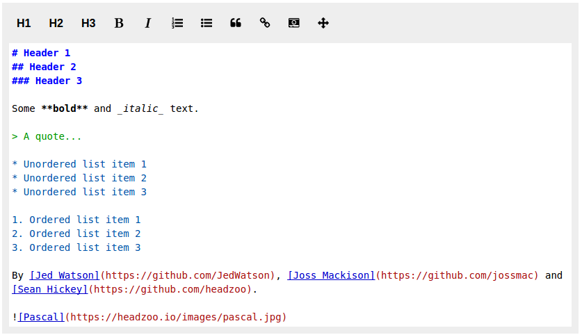
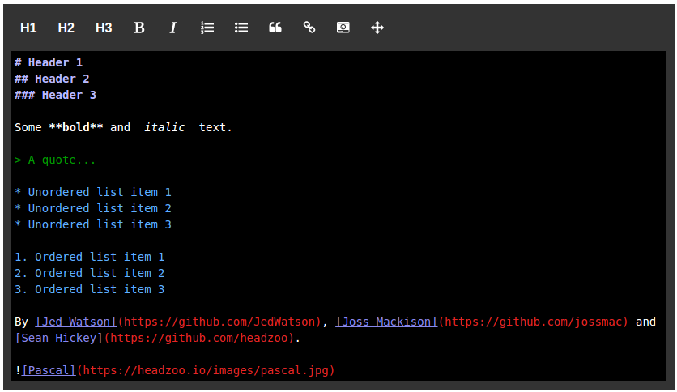

Themes
======
React Markmirror supports two build in themes named "light" and "dark", as well as supporting all themes supported by Codemirror by setting the `theme` prop. See the [Codemirror site](https://codemirror.net/demo/theme.html) for a demo of all themes.

The "light" and "dark" themes may be used without any additional setup. For example:

```jsx
<Markmirror theme="light" />
```



```jsx
<Markmirror theme="dark" />
```



Codemirror themes are also supported by including the appropriate css file from the Codemirror module.

_index.html_

```html
<!DOCTYPE html>
<html lang="en">
    <head>
        <title>React Markmirror</title>
        <meta charset="utf-8">
        <meta content="width=device-width, initial-scale=1" name="viewport">
        <link href="/node_modules/codemirror/theme/dracula.css" rel="stylesheet">
    </head>
    <body>
        <div id="mount"></div>
        <script src="/build/js/app.js"></script>
    </body>
</html>
```

_app.jsx_

```jsx
import React from 'react';
import Markmirror from 'react-markmirror';

const App = () => (
  <Markmirror theme="dracula" />
);
```

_Note: The actual location of the Codemirror theme css files depends on your setup. The example above assumes node_modules is in your web root._

The light and dark themes may be combined with CodeMirror themes in the following way.

```jsx
import React from 'react';
import Markmirror from 'react-markmirror';

const App = () => (
  <Markmirror theme="dark,dracula" />
);
```
